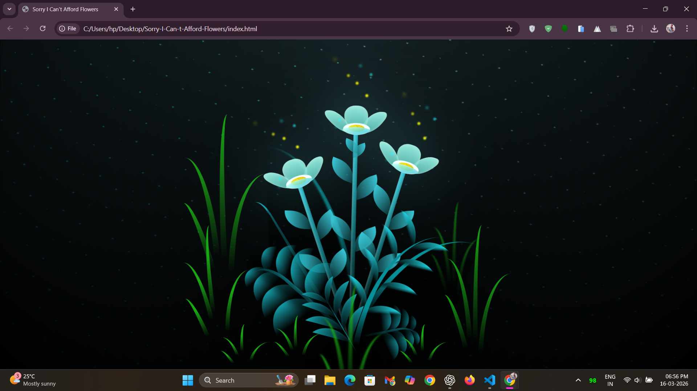

# Sorry-I-Can-t-Afford-Flowers

🌻💻 **HTML & CSS Flower Garden** 🌷🖥️  

Who needs a real bouquet when you can grow a garden in your browser? Welcome to the most bloomin' marvelous repository on the web! 🌼💐 

Are you tired of spending a fortune on flowers that wither away in a week? Look no further! You can cultivate an everlasting digital oasis of blossoms with just a sprinkle of HTML and a dash of CSS. No green thumb is required! 🌸🪴

## 📱 Live Demo

To view the live version of **Sorry-I-Can-t-Afford-Flowers**, visit: [Just You And Mee!](https://justyouandmee.netlify.app/)

Try it with parameters:
- [With Message](https://justyouandmee.netlify.app/?message=Hello%20Beautiful)
- [With Name](https://justyouandmee.netlify.app/?name=Love)
- [With Both](https://justyouandmee.netlify.app/?message=You%20Are%20Amazing&name=Darling)

### 🌟 Features

- **Responsive Design** - Looks beautiful on all devices
- **Animated Messages** - Glowing, floating text with sparkle effects
- **Name Integration** - Names appear on magical glowing flower lights
- **URL Encoding Support** - Handles spaces and special characters automatically
- **Mobile Optimized** - Perfect viewing experience on phones and tablets

## 🚀 Perfect For

- 💝 **Romantic gestures** - Say "I Love You" with digital flowers
- 🎉 **Birthday wishes** - Personalized birthday bouquets
- 💍 **Proposals** - Create a magical moment with custom messages
- 🎊 **Celebrations** - Any special occasion deserves digital flowers
- 💌 **Apologies** - When you can't afford real flowers but want to show you care

## 🎨 Technical Beauty

Our code blooms brighter than any tulip and is more dynamic than a daisy in a gentle breeze. Dive into our garden of divs, petal polygons, and color-coded chlorophyll! 🌹🌿

- **Pure CSS Animations** - No JavaScript libraries needed for flower animations
- **Interactive JavaScript** - Smart URL parameter handling
- **Glassmorphism Effects** - Modern, beautiful UI elements
- **Cross-browser Compatible** - Works everywhere

It's the perfect repo for those who believe love, like HTML tags, should be open. So, fork away and let your affection for coding and flora flourish! 🌺🌱

Remember, when words fail, code prevails. Share your digital posies and let love blossom in pixels and CSS properties. 🌹💝

**Warning:** May cause excessive smiles and CSS-induced allergies. 🤣

## 📄 License

MIT (Make it Terrific) - Feel free to plant and clone to your heart's content! 🌼🌼

Happy coding and blooming! 🌻🌻

## 🔐 Just You and Mee

